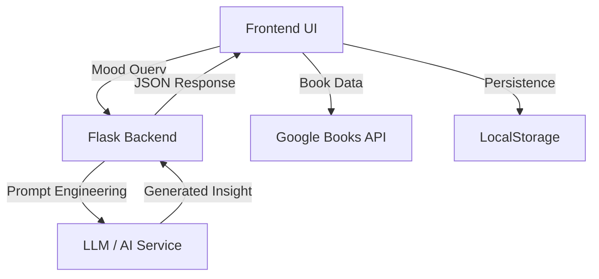

# System Architecture

> Frontend = Librarian  
> Backend = Curator  

This architecture demonstrates the separation of concerns:
- **Frontend UI:** Client-side mood queries and book interactions
- **Flask Backend:** Request handling, validation, and orchestration
- **LLM/AI Service:** Intelligent note and recommendation generation
- **Google Books API:** Book metadata and availability
- **LocalStorage:** Persistent client-side caching

See the API docs for endpoint details: [api.md](api.md)
