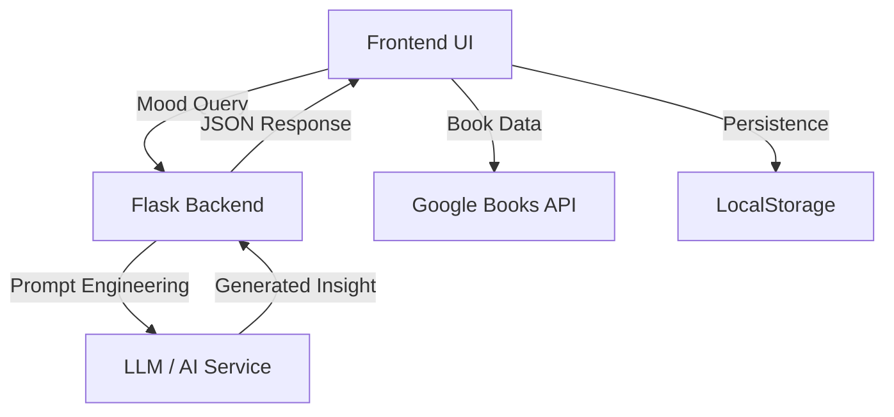

# Project Details

## 🚀 Features Roadmap

### Current Phase
- 🤖 **AI-powered recommendations** (core) — Mood-based discovery engine
- 🧠 **Conversational librarian (Elara)** — Chat-based book exploration
- 🌧️ **Mood-based discovery engine** — Dynamic vibe matching

### Upcoming
- 🎧 **Ambient environments** — Sound and UI atmosphere customization
- 📊 **Emotion analytics** — User mood tracking and insights (future)
- 🎯 **Social features** — Shared libraries and recommendations
- 🔐 **Advanced auth** — OAuth2, multi-factor authentication

---

## 🧠 System Architecture

> Frontend = Librarian  
> Backend = Curator  



This architecture demonstrates the separation of concerns:
- **Frontend UI:** Client-side mood queries and book interactions
- **Flask Backend:** Request handling, validation, and orchestration
- **LLM/AI Service:** Intelligent note and recommendation generation
- **Google Books API:** Book metadata and availability
- **LocalStorage:** Persistent client-side caching

---

## 🤖 Project Structure

See [project-structure.md](project-structure.md) for the full annotated tree with file descriptions.

---

## Screenshots

<div align="center">
  <h3>Discovery & Virtual Library</h3>
  
  <br><br>
  
  
  <p><i>Capturing the tactile, vibe-first essence of BiblioDrift.</i></p>
</div>

---

## 🧠 AI Service Integration & API Examples

To keep the frontend and backend synced, use the following mapping:

| Feature | Frontend Call (app.js) | API Endpoint (app.py) | Logic Provider (ai_service.py) |
| :--- | :--- | :--- | :--- |
| *Book Vibe* | POST /api/v1/generate-note | handle_generate_note() | generate_book_note() |

### Endpoint: Generate Book Note

*Method:* POST  
*URL:* /api/v1/generate-note  
*Description:* Generates an AI-powered "bookseller note" based on the book''s vibe, mood, and metadata.

---

### Request

*Headers*

```json
{
  "Content-Type": "application/json"
}
```

*Body*

```json
{
  "title": "The Night Circus",
  "author": "Erin Morgenstern",
  "mood": "mysterious, magical, slow-burn romance"
}
```

---

### Response

*Success (200 OK)*

```json
{
  "status": "success",
  "note": "A dreamlike duel unfolds in a wandering circus of shadows and light. Perfect for readers who crave atmospheric magic and quiet intensity."
}
```

*Error (400 Bad Request)*

```json
{
  "status": "error",
  "message": "Missing required fields: title or mood"
}
```

---

### API Flow Explanation

1. Frontend sends a POST request from app.js to /api/v1/generate-note.
2. The Flask backend (app.py) receives the request via handle_generate_note().
3. Input data (title, author, mood) is validated.
4. The request is passed to generate_book_note() in ai_service.py.
5. The AI model generates a contextual "bookseller note".
6. The backend returns the generated note as a JSON response.
7. Frontend displays the note in the book popup UI.

---

See [api.md](api.md) for more detailed endpoint documentation.
